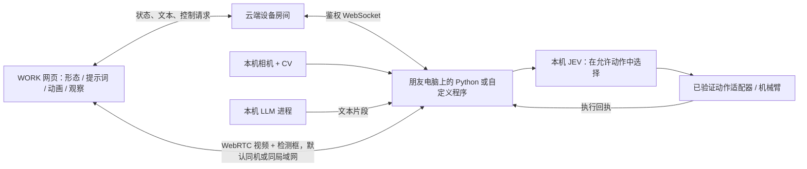

# Cowcoming 黑客松实时硬件接入方案

状态：网站、云端消息服务与本机示例均已实现；实际设备驱动和真实 JEV/LLM 由接入者提供。自动进化规则没有定义，本版本明确保持关闭。本文补充产品文档 §3.3、§5，以 Eric 在当前任务中提出的“密钥接入、朋友独立开发、提示词影响 JEV、视频本地优先”为准。

## 体验与职责

保留 WORK 原来的左进化、中央模型、右观察布局。在右侧点击 **Connect my 牛来**，输入实时服务 URL 和 **Browser connection key**。一次连接绑定整页；设备还没运行时显示 Waiting for device。连接信息可仅在当前浏览器标签页的 sessionStorage 保存，刷新自动恢复；Disconnect 会清除。没有浏览器指纹或固定 IP 绑定。

连接成功后：

- 左侧显示云端配置的形态、提示词版本和电脑端应用状态。点击已有节点仍是预览，不修改云端配置。
- **Device lab** 可以手动选择形态、编辑提示词、允许动作和动画映射；保存的配置有版本号。切换到曾编辑过的形态会载入它自己的提示词和动作配置。多人编辑发生版本冲突时拒绝覆盖，重新载入后再编辑。
- 电脑端收到新配置，先停止或结束原动作，应用配置，返回 `profile.applied`。只有回执匹配当前版本才能发送新动作。
- 本机 JEV 在允许动作集合里选择，报告 `decision`。网页仅从这个动作的动画映射中随机选择表现；完成状态来自独立的 `action` 回执。
- 右侧 **Vision / Action** 按需建立 WebRTC 连接，显示电脑端相机和本机 CV 检测框；**Large Language Model** 显示本机发送的输入与流式回复。
- 输入框发出 `interact` 给本机进程，由接入者决定如何调用 JEV 与语言模型；网页没有内置模型 API Key。
- 调试形态切换记录为 manual，不伪称自动成长。每种正式形态模型尚未补齐，中央继续明确使用参考模型；新增的点头、左右看、歪头是参考模型上的程序动画。



**云端存什么：**房间密钥哈希、当前配置、各形态配置、调试切换历史、有限长度的最近事件/对话、去重记录。相机帧和逐帧人物框不经过云端 HTTP/WebSocket，服务器不存视频。文本会经过云端并保留有限的最近对话，便于网页刷新恢复。

**本机负责什么：**真实 JEV/LLM 调用、摄像头、人物检测、硬件适配、动作限位、停止、执行结果。形态提示词影响候选动作的选择，不是可执行代码，不直接变成电机角度或任意 Shell 命令。

## 先在开发环境跑起来

需要 Node 24（仓库版本）、Python 3.11+。浏览器建议当前 Chrome/Edge。无需安装 Mac App；只准备正常开发依赖。

```sh
npm ci
cp server/.dev.vars.example server/.dev.vars
```

在本机私密编辑器里给 `server/.dev.vars` 填入随机生成的至少 32 字符 `ADMIN_KEY`；文件已被 Git 忽略。`ALLOWED_ORIGINS` 必须与网页的实际 origin 完全一致。示例使用网页 `http://127.0.0.1:4317` 与服务 `http://127.0.0.1:8794`。

两个终端分别执行：

```sh
npm run relay:dev
npm run dev -- --port 4317
```

为创建房间的终端提供环境变量 `COWCOMING_RELAY_URL` 和 `COWCOMING_ADMIN_KEY`（与服务端相同）。不要把值放进公共网页、Git 或聊天。创建命令将密钥写入权限为 0600 的新文件，不打印密钥：

```sh
npm run device:create -- "Desk 牛来" .pwc/desk.keys.json
```

输出文件包含 `relayUrl`、`roomId`、`label`、`browserKey`、`deviceKey`。网页填 `relayUrl` 与 `browserKey`；朋友的本地脚本只需要 `relayUrl` 与 `deviceKey`。管理密钥不交给设备脚本。

### 运行交付的示例

在朋友电脑上创建 Python 虚拟环境并安装 `examples/device/requirements.txt`。给运行进程配置：

- `COWCOMING_RELAY_URL`：实时服务 URL。
- `COWCOMING_DEVICE_KEY`：这个房间的设备密钥。

```sh
python examples/device/run.py
```

这会运行有明确 **SIMULATION** 标记的示例动作与语言输出，不控制机械臂、不调用 JEV/LLM。可先用它检查网页、提示词更新、动画和文本是否接通。

有摄像头时安装 `requirements-camera.txt` 并运行：

```sh
python examples/device/run.py --camera 0
```

只有网页点击 **Start video** 时才打开相机；OS 摄像头权限仍需允许。OpenCV HOG 在电脑端做人物检测，视频通过 WebRTC，框通过同一个 PeerConnection 的 `perception` DataChannel。HOG 是便于联调的基础检测器，适合替换为接入者已有的 YOLO/姿态模型；不声称已验证所有光线、遮挡或姿态的识别效果，也不做人物身份或性别识别。

不访问真实相机的联调模式：

```sh
python examples/device/run.py --test-video
```

画面会明确写出 SYNTHETIC TEST VIDEO，框也是测试目标，不冒充真人检测。

## 接入真实 JEV、机械臂和 LLM

创建自己的 Python 模块，例如 `my_adapter.py`，实现 `examples/device/adapter.py` 中的方法，然后：

```sh
PYTHONPATH=/path/to/your/code python examples/device/run.py --adapter my_adapter:Adapter --camera 0
```

接口约定：

| 方法 | 输入 | 返回 / 职责 |
| --- | --- | --- |
| `simulation` 属性 | 无 | 实机适配器设为 `False`；示例为 `True` |
| `async status()` | 无 | `name, hardware, jev, language`，组件状态为 ready/offline/error/unknown |
| `async apply_profile(profile)` | revision、formId、prompt、allowedActions、animationMap | 真正将提示词应用给本地 JEV 后返回；失败应抛异常，不发送应用成功 |
| `async decide(user_input, requested_action=None)` | 输入文本；调试按钮可能指定候选动作 | `{actionId, summary}`；真实 JEV 结合 profile.prompt 并在 allowedActions 中选择。summary 是简短决策说明，不要求内部推理过程 |
| `async execute(action_id)` | 已校验的高层动作 ID | `{status, detail}`；只有真实完成证据才返回 completed，仅写入串口应返回 sent，无回读返回 unknown |
| `async stop()` | 无 | `{confirmed: bool, detail: str}`；确认控制器停止才返回 True |
| `async reply(user_input)` | 用户输入 | 异步生成器，逐次 yield 字符串；模型与模型密钥留在本机 |

本机已有其他语言或完整工程也可以直接使用下节协议，无须依赖 Python 示例。JEV 输出的动作 ID 首版固定为 NOD、LOOK、TILT、WAVE、WAIT；新增硬件动作时共同扩展 `shared/live-protocol.mjs` 的白名单及其动画映射。模型不能通过返回未知 ID 扩大能力。

## HTTP API（协议版本 1）

所有响应 `Cache-Control: no-store`。云端部署必须 HTTPS。浏览器跨域来源使用服务端 `ALLOWED_ORIGINS` 精确白名单，拒绝通配来源；本机脚本不需要 Origin。

| 请求 | 鉴权 | 请求体 | 成功结果 |
| --- | --- | --- | --- |
| `GET /health` | 无 | 无 | `{service:"cowcoming-live", protocol:1}` |
| `POST /v1/rooms` | `Authorization: Bearer <ADMIN_KEY>` | `{label:"Desk cow"}` | `{roomId,label,browserKey,deviceKey}`，明文密钥仅返回这次 |
| `POST /v1/rooms/{roomId}/rotate` | ADMIN_KEY | 无 | 新 browserKey/deviceKey；旧密钥、未用 ticket 和已连接 socket 一并撤销 |
| `POST /v1/connect` | 浏览器或设备密钥 | 无 | `{roomId,ticket,expiresIn:30}` |
| `GET /v1/socket/{roomId}?ticket=...` | 一次性 ticket | WebSocket Upgrade | 升级后先收到 welcome、snapshot；设备端还收到 profile |

密钥格式：`cw1.browser.<roomId>.<64位hex>` 或 `cw1.device.<roomId>.<64位hex>`。每把使用 256-bit 随机值，服务端保存 SHA-256 哈希。ticket 只使用一次、30 秒到期。持久密钥不放在 URL。一个房间只有一个设备写入进程；第二个在线设备不能抢占，需停掉原进程或由管理员轮换密钥。

首版 browser key 是受信任开发者的读写权限；不要把它放在公开展示链接。匿名围观和只读观众密钥不在本版范围。

错误采用 HTTP 400/401/403/409/429 或 WebSocket `{type:"error",error:"..."}`。未授权、过期、角色越权、旧版本配置、未知动作均被拒绝。重试动作需用户重新操作。

## WebSocket 消息

所有消息为 JSON。单条上限 96 KB，每连接最多 80 条/秒；SDP 最多 60 KB。客户端每 10 秒发送 `{type:"ping"}`，服务端返回 pong；没有有效心跳约 30 秒视为失联，由清理闹钟关闭连接。网页不重放旧指令、不用 snapshot 播放过去的动画。

### 服务端 → 双方

```json
{"type":"welcome","role":"browser","clientId":"uuid","protocol":1,"heartbeatMs":10000}
```

浏览器的 `snapshot` 包括 `roomId,label,version,profile,formProfiles,appliedRevision,deviceOnline,device,events,messages,revealed,history,evolutionMode,updatedAt`。`profile` 是云端期望配置，`appliedRevision` 是电脑端明确确认的版本。deviceOnline 只证明连接进程在线，各组件状态分别判断。设备端只收到精简快照（roomId/version/profile/deviceOnline），避免将历史对话重复发送给驱动。

### 网页 → 云端 → 设备

保存云端配置：

```json
{"type":"profile.update","expectedRevision":1,"formId":"normal","prompt":"回应时优先选择轻轻点头。","allowedActions":["NOD","LOOK","WAIT"],"animationMap":{"NOD":["nod-soft","nod-double"],"LOOK":["look-left","look-right"],"WAIT":["idle"]}}
```

新配置存储成功后，设备收到 `{type:"profile",profile:{revision:2,...}}`。设备应用后发送：

```json
{"type":"profile.applied","eventId":"unique-id","revision":2}
```

指令：

```json
{"type":"command","commandId":"unique-id","command":"interact","input":"你好，牛来"}
{"type":"command","commandId":"unique-id","command":"action","actionId":"NOD"}
{"type":"command","commandId":"unique-id","command":"stop"}
```

云端补上 `profileRevision` 和 `expiresAt`（5 秒内必须开始接收处理），仅转发给当前在线设备。设备必须验证过期、配置版本与 commandId 去重。云端的 `command.sent` 只代表已转发，本机 `command.result` 才报告 accepted/completed/stopped/failed/interrupted/unknown。Stop 不受提示词版本阻塞，仍需本机确认；网页断线时不能代替现场停止入口。

### 设备 → 云端 → 网页

所有设备事件必须有唯一 `eventId`（建议 UUID）。重复 eventId 不重复更新状态或播放动画；已有 completed/failed/interrupted 的动作不接受倒退状态。

```json
{"type":"device.status","eventId":"status-1","name":"Desk computer","hardware":"ready","camera":"ready","jev":"ready","language":"ready","simulation":false}
{"type":"observation","eventId":"obs-1","text":"检测到一位参与者"}
{"type":"decision","eventId":"dec-1","decisionId":"decision-1","commandId":"command-1","profileRevision":2,"actionId":"NOD","summary":"对问候做点头回应"}
{"type":"action","eventId":"act-1","decisionId":"decision-1","status":"started","detail":"控制器开始动作"}
{"type":"action","eventId":"act-2","decisionId":"decision-1","status":"completed","detail":"控制器回报动作完成"}
{"type":"command.result","eventId":"result-1","commandId":"command-1","status":"completed","detail":"本轮回应完成"}
```

`action.status` 允许 accepted/started/completed/interrupted/failed/unknown/sent。主动感知触发的 JEV 决策可以不带 commandId，但必须使用已应用的 profileRevision。网页仅对新收到的 `live.decision` 随机播放一次映射动画；收到完成回执不会再播一次。

语言流（user/assistant/system 三种 role）：

```json
{"type":"language.start","eventId":"s1","messageId":"m1","role":"assistant","text":""}
{"type":"language.delta","eventId":"d1","messageId":"m1","text":"你好"}
{"type":"language.delta","eventId":"d2","messageId":"m1","text":"，我是牛来。"}
{"type":"language.end","eventId":"e1","messageId":"m1"}
```

开始、片段、结束各有独立 eventId，messageId 相同。`language.end` 可选 `status` 为 complete/interrupted/failed，默认 complete；已结束消息拒绝晚到片段。断线时尚未结束的流标记 interrupted。`log` 事件的 `text` 可供调试抽屉查看。

## WebRTC：本地摄像头与 CV

浏览器点击 Start video 后成为 offerer，添加 recvonly video transceiver 和名为 `perception` 的 DataChannel。云端仅转发：

```json
{"type":"signal","peerId":"welcome里的浏览器clientId","kind":"offer","sdp":"..."}
{"type":"signal","peerId":"同上","kind":"answer","sdp":"..."}
{"type":"signal","peerId":"同上","kind":"ice","candidate":{"candidate":"...","sdpMid":"0","sdpMLineIndex":0}}
{"type":"signal","peerId":"同上","kind":"close"}
```

浏览器只能向设备发送属于自己的 offer/ice/close，设备 answer/ice/close 只发给目标浏览器。SDP/ICE 是连接元数据，不是视频帧。

检测数据通过 WebRTC DataChannel 直接发给浏览器：

```json
{"type":"detections","frameId":123,"source":"Your local detector","boxes":[{"id":"track-1","label":"person","confidence":0.93,"bbox":[0.25,0.1,0.3,0.7]}]}
```

bbox 为相机原图坐标归一化的 `[x,y,width,height]`，范围 0–1，不应预先镜像。每帧最多展示 30 个框。没有真实检测时传空数组，不能用占位框冒充识别。浏览器按视频自然宽高比显示，检测数据超过 1 秒不再画框，视频没有新帧超过 2.5 秒显示等待状态。示例的框与视频为尽力实时同步，未承诺逐帧精确对齐。

**网络边界：**默认 `iceServers: []`，不配置 TURN，不经服务器转发媒体。优先支持同机/同局域网，20 秒连不上会显示重试说明。跨公网或严格网络不保证直连；后续若要支持可加入 STUN/TURN，但必须同步更改“直连、不经云端”的产品表述并展示实际连接类型。本版不为了演示偷偷上传 JPEG 或转发视频。

## 部署到现有网站

现有 `cowcoming.world` 仍部署到原 Pages 项目，不改域名或 DNS。实时服务是同仓库的独立 Worker `cowcoming-live`，不是另建同名 Pages 站点。

1. 在自己的已授权 Cloudflare 环境执行 `npm run relay:deploy`。需要该账户 Workers 的部署权限；原来只有 Pages/Edit 的 Token 不够。
2. 在该 Worker 设置服务端 Secret：`npx wrangler secret put ADMIN_KEY --config server/wrangler.jsonc`，输入随机管理密钥，不提交源码。
3. 核对 `server/wrangler.jsonc` 的 ALLOWED_ORIGINS。默认含 cowcoming.world 和现有两个站点，不开放任意 preview 域名。
4. 获取 Worker 的 HTTPS URL，创建房间，把 browserKey 给网页操作者、deviceKey 给朋友。
5. 网站构建可设置公开变量 `VITE_COWCOMING_RELAY_URL`（GitHub Actions 使用仓库变量 `COWCOMING_RELAY_URL`），省去用户填写服务 URL；不设置时 UI 仍可手动填写。不能把任何密钥放进 VITE_*。
6. 按 `docs/deployment.md` 把已验证网站版本发布到原 Pages 项目。网站和 Worker 是两个分别可核对的部署步骤。

2026-09-23 已经 Eric 授权完成本机 OAuth 发布：实时服务为 `https://cowcoming-live.shangyiyong98.workers.dev`，网站仍为 `https://cowcoming.world/?section=work`。正式房间与角色密钥已生成，密钥仅保存在私密交接文件。GitHub 仓库设置了 `COWCOMING_RELAY_URL`，尚无部署 Secret/启用变量，所以后续 main 合并仍不会自动上线。完整状态见 [部署说明](deployment.md)。无需为接口联调安装或替换用户电脑上的产品程序。

生产验收已通过公网鉴权、角色隔离、提示词版本确认、动作和文本同步、信令、重连、密钥撤销；正式页面通过直连合成视频/CV、动画映射、文本流、刷新不重放、中英文和手机宽度检查。合成视频不是用户摄像头，也不是实际人物识别或机械臂验收。

## 验证命令与交付边界

```sh
npm test
npm run build
# 自动启动并清理隔离的测试 Worker，无需手工密钥：
npm run test:relay
# 或对已启动的测试服务提供 TEST_RELAY_URL / TEST_RELAY_ADMIN：
npm run test:relay:running
# 同时启动网站开发服务，QA_BASE_URL 指向它：
npm run qa:live
# DEVICE_PYTHON 指向已安装 camera requirements 的 Python：
npm run qa:device
python -m unittest discover -s examples/device -p 'test_*.py'
```

本机 QA 可使用 `.pwc/live-admin.json` 的私密测试管理密钥回退；这个文件不随交付提供，其他电脑应通过环境变量提供。浏览器脚本默认使用 macOS 的 Chrome，可用 CHROME_PATH 指定现有浏览器路径。

真实机械臂型号、JEV 调用协议、真实 LLM 后端和正式形态模型仍需接入者提供；这些不能由联调模拟结果替代。现在交付的是已可运行的软件接口与端到端示例，不宣称已完成真实硬件验收。
